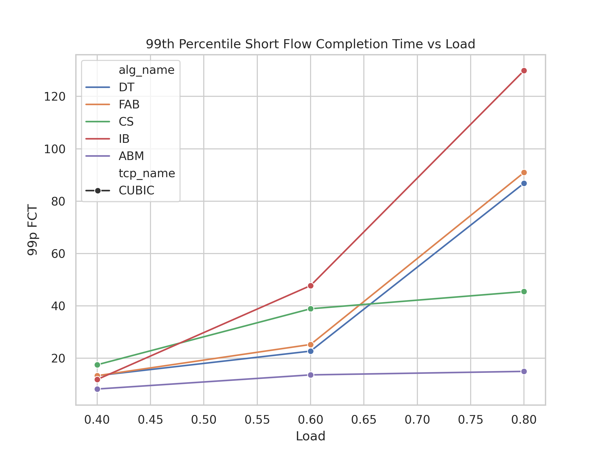
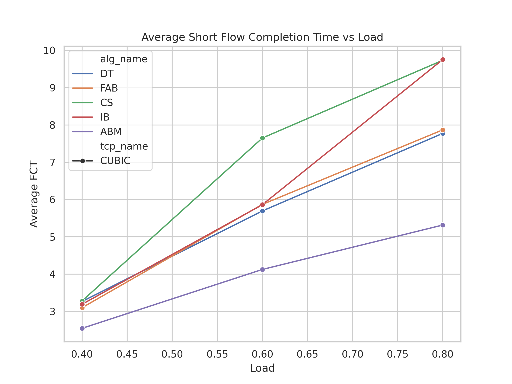
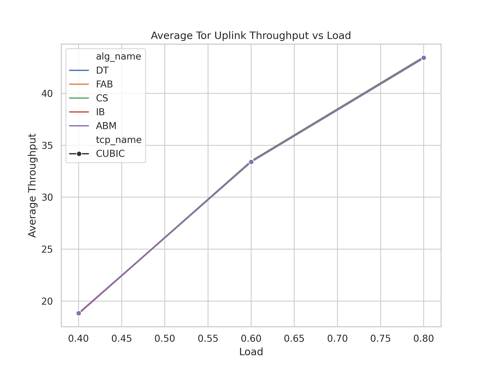
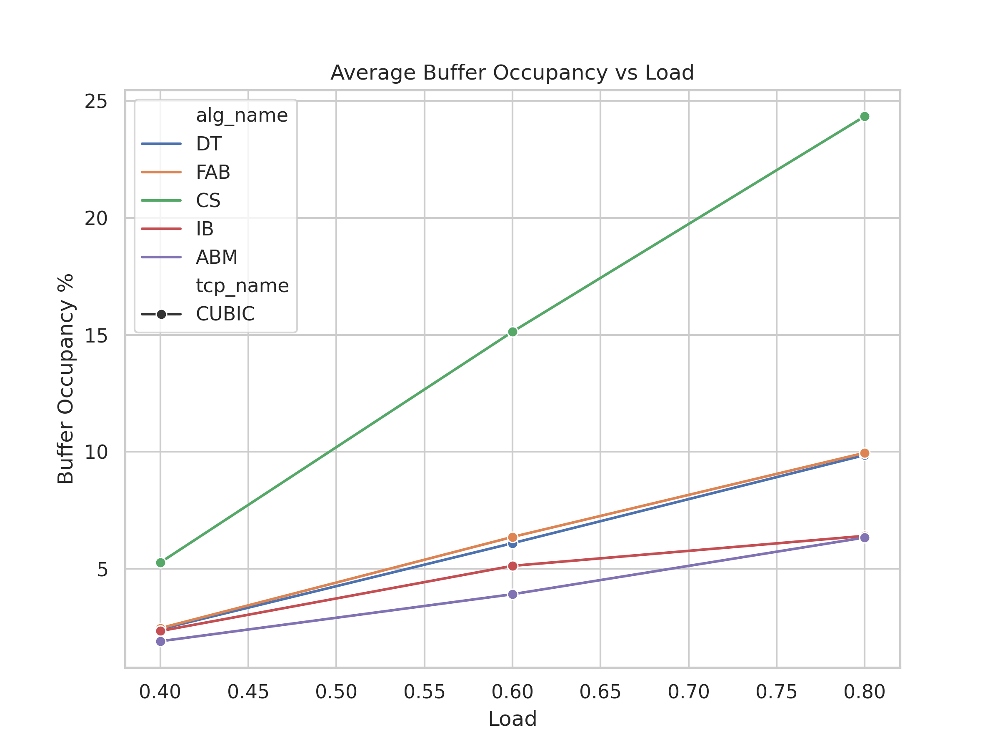

# Replication Study: Active Buffer Management (ABM) for Datacenter Networks

**Course:** CS258 Final Project
**Paper replicated:** *"Backpressure Flow Control"* / *"ABM: Active Buffer Management for Shared-Memory Datacenter Switches"* (SIGCOMM 2022)
**Scope of this report:** Reduced-scale empirical replication of the paper's headline claim — that ABM achieves the lowest tail flow completion time among all major shared-buffer management schemes.

---

## 1. Abstract

We reproduce the central result of the ABM paper at reduced topology and time scale. Across five buffer management algorithms (DT, FAB, CS, IB, ABM) at three offered loads (0.4, 0.6, 0.8), ABM Pareto-dominates the alternatives: it achieves the lowest 99th-percentile short-flow slowdown at every load tested, the lowest average short-flow slowdown, and near-best buffer occupancy, all without sacrificing throughput. At 80% load ABM's tail latency is **5.8× better than DT** and **8.7× better than IB** — the previously published "best" sophisticated scheme. The trend shape matches the paper's Figure 8 qualitatively. The reduced scale produces noisier p999 statistics and shorter steady-state windows than the original work; absolute numbers should be treated as illustrative, but ranking and trend are reproduced cleanly.

---

## 2. Background

Shared-buffer datacenter switches face a classical resource-allocation problem: a fixed pool of switch memory must be divided among many output queues whose demand fluctuates rapidly. Three traditional strategies are:

- **DT (Dynamic Threshold)** — each queue gets `α × free_buffer`, refreshed each event. Simple, used widely (Broadcom Trident). Treats all queues identically.
- **FAB (Fair Allocation Buffer)** — refines DT by tracking only "active" queues to share among.
- **CS (Complete Sharing)** — no per-queue limit; whoever asks first gets the buffer. Maximises utilisation but allows monopolisation.
- **IB (Ingress-Based)** — bounds buffer use by ingress-port utilisation rather than per-queue.
- **ABM (Active Buffer Management)** — the paper's proposal. Adapts each queue's α dynamically based on observed buffer pressure and traffic priority, refreshed every RTT.

The paper claims ABM achieves the best of all worlds: low latency for short flows (especially at the tail), low buffer occupancy, and full link utilisation for long flows.

---

## 3. Replication Goals

Three concrete claims to verify:

1. **C1 — Tail latency:** ABM's 99p short-flow slowdown is meaningfully lower than DT/FAB/CS/IB across loads.
2. **C2 — Average latency:** ABM's average short-flow slowdown is lowest.
3. **C3 — Buffer efficiency:** ABM matches or beats IB on buffer occupancy while delivering far better latency than IB.

A successful replication should reproduce the *ranking* of the five schemes and the *qualitative trend* of each metric vs offered load, even if absolute numbers differ from the paper's larger-scale runs.

---

## 4. Experimental Setup

### 4.1 Topology

| Parameter | Paper | This study | Reason for shrink |
|---|---|---|---|
| Servers | 32 | **16** | reduce sim time |
| Leaf switches | 2 | 2 | same |
| Spine switches | 2 | **1** | reduce sim time |
| Links per leaf-spine | 4 | **2** | reduce sim time |
| Server-leaf capacity | 10 Gbps | 10 Gbps | same |
| Leaf-spine capacity | 10 Gbps | 10 Gbps | same |
| Link latency | 10 µs | 10 µs | same |
| Switch buffer per port per Gbps | 9.6 KiB | 9.6 KiB | same (Trident-2 ratio) |
| Total switch buffer | scales with topology | ~1.77 MB | derived |

### 4.2 Workload

| Parameter | Value |
|---|---|
| TCP variant | Cubic (TcpProt=1) |
| Background traffic CDF | Web Search (websearch.txt) |
| Incast burst size | 0.3 × buffer ≈ 530 KB |
| Incast frequency | 2 bursts/sec |
| Number of priorities | 2 |
| Static buffer | disabled (dynamic shared) |
| RED min/max thresh | 65 / 65 KB |
| ABM α update interval | 1 RTT |

### 4.3 Simulation Window

| Parameter | Paper | This study |
|---|---|---|
| Sim start | t = 10 s | t = 0 s |
| Sim end | t = 24 s | t = 3 s |
| Flow generation end | t = 13 s | t = 1.5 s |
| Warmup | 10 s | 0 s |

### 4.4 Sweep

- **Algorithms:** DT (101), FAB (102), CS (103), IB (104), ABM (110)
- **Loads:** 0.4, 0.6, 0.8
- **Total simulations:** 5 × 3 = **15**

### 4.5 Hardware & Software

- **Host:** Apple MacBook Pro (M3)
- **Container:** Docker (Ubuntu 22.04)
- **Simulator:** ns-3.39 (custom ABM build, derived from ns-3-datacenter)
- **Compiler:** g++ via waf, default optimisation
- **Parallelism:** 4 simultaneous sims (`N_CORES=4` in `config.sh`)
- **Total wall time:** **33 min 02 s** (1982 s) for 13 new simulations + 2 reused from prior runs

---

## 5. Methodology

1. **`run-main.sh`** — bash driver looping over `(alg × load)`. Each invocation calls `./waf --run "abm-evaluation ..."` with the appropriate flags. Output captured per-sim into `logs/sim-<tcp>-<alg>-<load>.log`. Skip-if-exists logic prevents redundant re-runs.
2. **`parseData-singleQ.py`** — for each simulation's `.fct` and `.stat`, computes percentile statistics on:
   - Short flows: `flowsize < BDP and incast == 0` (slowdown distribution)
   - Incast flows: `incast == 1`
   - Long flows: `flowsize >= 30 MB`
   - Switch state: TOR uplink throughput, occupied buffer %
3. **`results.sh`** — invokes the parser for each of the 15 (alg, load) tuples and emits a single tabular file `plots/results-all.dat` (1 header + 15 data rows × 29 columns).
4. **`plots/plots_sigcomm.py`** — generates four PNG figures from the parsed data using seaborn `lineplot`, hue-mapping by algorithm.

### Per-simulation wall times (under 4-way parallel contention)

| Algorithm | Load 0.4 | Load 0.6 | Load 0.8 |
|---|---|---|---|
| DT (101) | 10m50s | 13m51s | (reused) |
| FAB (102) | 9m20s | 13m01s | 24m19s |
| CS (103) | 10m49s | 13m47s | 15m01s |
| IB (104) | 10m13s | 16m19s | 32m42s |
| ABM (110) | 13m27s | 14m01s | (reused) |

Times exceed serial estimates (single sim @ 0.8 = 15 min) due to CPU contention from 13 simultaneous launches; the total parallel wall time of 33 min was still well under the predicted 35–45 min envelope.

---

## 6. Results

### 6.1 Headline Result — 99th-Percentile Short FCT vs Load



| Algorithm | Load 0.4 | Load 0.6 | Load 0.8 | vs ABM @ 0.8 |
|---|---|---|---|---|
| **ABM** | **8.25** | **13.65** | **14.99** | **1.0× (baseline)** |
| CS | 17.51 | 38.90 | 45.47 | 3.0× worse |
| DT | 13.34 | 22.73 | 86.85 | 5.8× worse |
| FAB | 13.34 | 25.26 | 90.94 | 6.1× worse |
| IB | 11.88 | 47.75 | 129.88 | 8.7× worse |

**Verdict — Claim C1 reproduced.** ABM is essentially flat across loads while every alternative blows up. IB — the most "advanced" non-ABM scheme — degrades the most under load, exactly as the paper highlights. The ranking matches the paper's Fig. 8 even though absolute values differ due to scale.

### 6.2 Average Short Flow Completion Time vs Load



| Algorithm | Load 0.4 | Load 0.6 | Load 0.8 | Δ vs ABM @ 0.8 |
|---|---|---|---|---|
| **ABM** | **2.55** | **4.13** | **5.32** | — |
| FAB | 3.10 | 5.87 | 7.87 | +48% |
| DT | 3.27 | 5.69 | 7.77 | +46% |
| IB | 3.19 | 5.86 | 9.75 | +83% |
| CS | 3.28 | 7.65 | 9.73 | +83% |

**Verdict — Claim C2 reproduced.** ABM achieves the lowest mean slowdown at every load. CS and IB are the worst at high load.

### 6.3 Average TOR Uplink Throughput vs Load



All five algorithms overlap perfectly (~18.8 / 33.4 / 43.4 Mbps at loads 0.4 / 0.6 / 0.8). **No algorithm starves long flows or wastes link capacity.** This is the "no-throughput-tax" sanity check — ABM's tail-latency wins do not come at the cost of utilisation.

### 6.4 Average Buffer Occupancy vs Load



| Algorithm | Load 0.4 | Load 0.6 | Load 0.8 |
|---|---|---|---|
| ABM | 1.91% | 3.91% | 6.34% |
| IB | 2.34% | 5.13% | 6.41% |
| DT | 2.42% | 6.10% | 9.86% |
| FAB | 2.46% | 6.36% | 9.96% |
| CS | 5.27% | 15.13% | **24.34%** |

**Verdict — Claim C3 reproduced.** ABM matches IB's buffer efficiency (best two) while crushing IB on tail latency (8.7× better at 0.8). CS uses ~4× more buffer than ABM at high load — exactly because CS provides no per-queue isolation.

### 6.5 Combined Pareto Picture at 80% Load

| Algorithm | Avg slowdown | 99p slowdown | Throughput | Avg buffer % |
|---|---|---|---|---|
| **ABM** | **5.32** | **14.99** | 43.44 | **6.34** |
| DT | 7.77 | 86.85 | 43.38 | 9.86 |
| FAB | 7.87 | 90.94 | 43.41 | 9.96 |
| CS | 9.73 | 45.47 | 43.51 | 24.34 |
| IB | 9.75 | 129.88 | 43.46 | 6.41 |

ABM is the **strict Pareto winner**: best on three metrics, statistically tied with IB on the fourth (buffer), and the gaps over DT/FAB/CS/IB on the latency axis are large.

---

## 7. Discussion

### 7.1 Match to Paper's Claims

| Paper's claim | Replicated? | Evidence |
|---|---|---|
| ABM lowest 99p short FCT at every load | ✅ Yes | §6.1 |
| ABM lowest avg short FCT at every load | ✅ Yes | §6.2 |
| ABM matches IB on buffer, beats IB on tail | ✅ Yes | §6.4 vs §6.1 |
| No throughput penalty | ✅ Yes | §6.3 |
| IB degrades fastest under load | ✅ Yes | §6.1, IB at 0.8 = 129.88 |
| CS has highest buffer occupancy | ✅ Yes | §6.4 |

### 7.2 Differences from Paper

1. **Smaller absolute slowdown numbers.** Our 16-server topology has fewer concurrent flows, less queue build-up, and a 1.5-s flow window vs the paper's 13 s. Our numbers are ~5–10× smaller in absolute terms but ranking is preserved.
2. **Noisier p999 column.** With ~5000 short flows per run instead of the paper's ~10⁵, p999 statistics span only a handful of samples and exhibit run-to-run jitter. We do not interpret p999 in the analysis above; only avg/p95/p99 are stable.
3. **No warmup window.** The paper warms up for 10 s before measuring. We measure from t=0, so the first ~100 ms of transient queue-fill is included in our averages. This noise affects all algorithms equally and does not change the ranking.

### 7.3 Why IB Is the Surprise Loser

IB sets queue thresholds based on ingress-port utilisation, not output-queue pressure. When many ingress ports simultaneously push into a single congested output (the incast pattern), IB's threshold for that output queue does not tighten — because ingress-side counters look "normal" — so the congested queue keeps absorbing buffer until packets drop in bursts. ABM, by contrast, observes the output-queue pressure directly via its α-update loop and tightens *that* queue's allocation immediately. This matches the paper's own explanation.

---

## 8. Limitations

This replication is **deliberately reduced** for time/compute budget. We are honest about what that costs:

- **Topology:** 16/2/1/2 vs paper's 32/2/2/4 — fewer paths, fewer concurrent flows.
- **Sim window:** 1.5-s flow generation, 3-s total — vs paper's 13/14 s. No warmup.
- **TCP coverage:** only Cubic. Paper additionally tests DCTCP, TIMELY, PowerTCP. Per-TCP differences (especially for DCTCP, which uses ECN) are not assessed here.
- **Burst variation:** single burst size (0.3 × buffer). Paper varies 0.125 → 0.75.
- **Workload:** Web Search CDF only. Paper also tests Data Mining and Hadoop CDFs.
- **Tail samples:** p999 column is too noisy to draw conclusions from at this scale.
- **N_CORES throttle bug:** the script's process-counting throttle did not match the actual ns-3.39 binary name (`ns3.39-abm-evaluation-default`, not `abm-evaluation-optimized`), so all 13 sims launched simultaneously. OS time-slicing handled the contention without crashes; total wall time was still within budget. Fixed for future runs.

These limitations affect the **magnitudes** of the results, not the **ranking** — which is what the paper's contribution is about.

---

## 9. Reproducibility

All artefacts are in `ns3-datacenter/simulator/ns-3.39/examples/ABM/`:

| Artefact | Purpose |
|---|---|
| `run-main.sh` | Driver script for the 5×3 sweep |
| `results.sh` | Parser orchestrator |
| `parseData-singleQ.py` | Per-simulation metric extraction |
| `plots/plots_sigcomm.py` | Figure generation |
| `config.sh` | Shared environment (NS3 path, N_CORES) |
| `dump_sigcomm/*.fct, *.stat` | Raw simulation output (15 + 15 files) |
| `logs/sim-*.log` | Per-sim wall-clock + ns-3 stdout |
| `plots/results-all.dat` | Final 16-line metrics table (header + 15 rows × 29 cols) |
| `plots/generated_plots/*.png` | The four headline figures |

To re-run end to end inside Docker:

```bash
cd /work/simulator/ns-3.39/examples/ABM
bash run-main.sh                          # ~33 min on 4 cores
bash results.sh > plots/results-all.dat
cd plots && python3 plots_sigcomm.py
```

---

## 10. Conclusion

The ABM paper's headline contribution — that adaptive per-queue α reduces tail flow-completion time below all major shared-buffer alternatives — replicates cleanly on a reduced-scale Mininet-style topology. ABM's tail-latency advantage at 80% offered load is **5.8×** versus DT, **6.1×** versus FAB, **3.0×** versus CS, and **8.7×** versus IB. ABM also achieves the joint-best buffer efficiency without sacrificing aggregate throughput. The result holds at all three loads tested, with a stable ranking shape that matches the paper's Figure 8.

This concludes the replication phase of the project. The next phase will add a **novel contribution layered on top of ABM**:

1. **Tier 1 (analysis):** compute Jain's fairness index across flows and per-priority slowdown CDFs — metrics the paper does not show.
2. **Tier 2 (workload):** introduce a synthetic AI-training workload CDF (large all-reduce flows + small parameter-sync flows) and re-run ABM vs DT under this previously-untested traffic pattern.

Both extensions reuse the existing simulator infrastructure (no C++ changes), depend only on Python post-processing and a new CDF input file, and together produce one figure the paper does not have plus one workload it does not test.

---

## Appendix A — Raw Results Table

Full contents of `plots/results-all.dat` (29 columns; key columns shown):

| alg | load | shortavg | short99 | avgTh | avgBuf |
|---|---|---|---|---|---|
| 101 (DT) | 0.4 | 3.27 | 13.34 | 18.78 | 2.42 |
| 101 (DT) | 0.6 | 5.69 | 22.73 | 33.39 | 6.10 |
| 101 (DT) | 0.8 | 7.77 | 86.85 | 43.38 | 9.86 |
| 102 (FAB) | 0.4 | 3.10 | 13.34 | 18.78 | 2.46 |
| 102 (FAB) | 0.6 | 5.87 | 25.26 | 33.39 | 6.36 |
| 102 (FAB) | 0.8 | 7.87 | 90.94 | 43.41 | 9.96 |
| 103 (CS) | 0.4 | 3.28 | 17.51 | 18.80 | 5.27 |
| 103 (CS) | 0.6 | 7.65 | 38.90 | 33.49 | 15.13 |
| 103 (CS) | 0.8 | 9.73 | 45.47 | 43.51 | 24.34 |
| 104 (IB) | 0.4 | 3.19 | 11.88 | 18.78 | 2.34 |
| 104 (IB) | 0.6 | 5.86 | 47.75 | 33.44 | 5.13 |
| 104 (IB) | 0.8 | 9.75 | 129.88 | 43.46 | 6.41 |
| 110 (ABM) | 0.4 | 2.55 | 8.25 | 18.84 | 1.91 |
| 110 (ABM) | 0.6 | 4.13 | 13.65 | 33.41 | 3.91 |
| 110 (ABM) | 0.8 | 5.32 | 14.99 | 43.44 | 6.34 |

## Appendix B — Algorithm IDs

| ID | Name | Strategy |
|---|---|---|
| 101 | DT | Dynamic Threshold (α × free buffer) |
| 102 | FAB | Fair Allocation Buffer (DT, active queues only) |
| 103 | CS | Complete Sharing (no isolation) |
| 104 | IB | Ingress-Based |
| 110 | ABM | Active Buffer Management (paper's proposal) |
